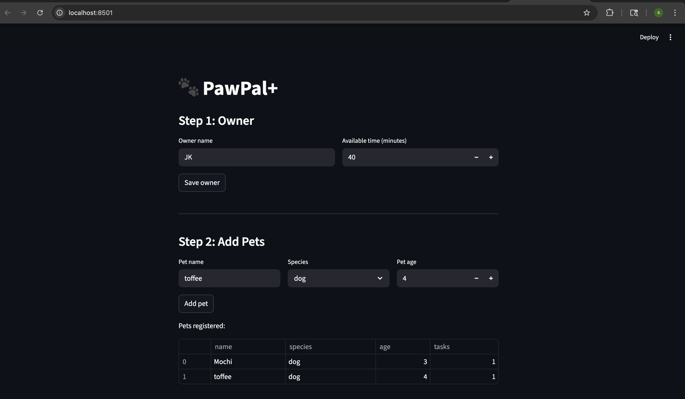
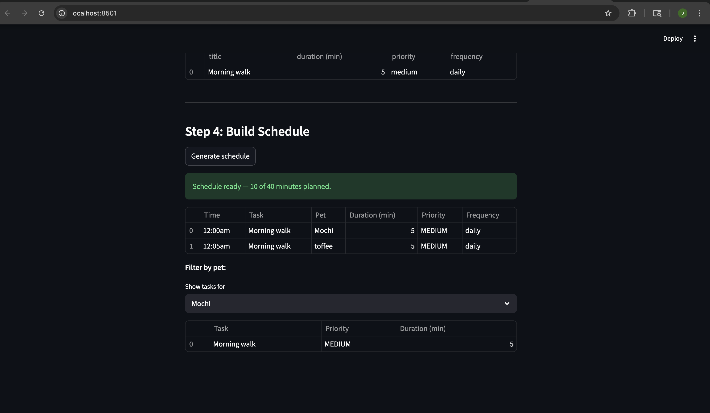

# PawPal+ (Module 2 Project)

**PawPal+** is a Streamlit app that helps a pet owner plan and manage daily care tasks across multiple pets — with smart scheduling, conflict detection, and automatic task recurrence.

---

## 📸 Demo






---

## Features

- **Multi-pet support** — register multiple pets under one owner, each with their own task list
- **Priority-based scheduling** — high-priority tasks are always scheduled first; among equal-priority tasks, shorter ones run first to maximize tasks within the time budget
- **Time budget enforcement** — tasks that would exceed the owner's available minutes are automatically excluded from the plan
- **Sorting by time** — the generated schedule is displayed in chronological order using `sort_by_time()`
- **Conflict warnings** — `detect_conflicts()` checks every pair of scheduled tasks for overlapping time windows and surfaces warnings directly in the UI before the owner acts on the plan
- **Daily recurrence** — completing a `daily` task automatically creates a new instance due the next day using Python's `timedelta`
- **Weekly recurrence** — completing a `weekly` task reschedules it 7 days out
- **Filter by pet** — view only the tasks belonging to a specific pet from the generated schedule
- **Filter by status** — retrieve pending or completed tasks independently

---

## System Architecture

Four core classes in `pawpal_system.py`:

| Class | Responsibility |
|---|---|
| `CareTask` | Data container for a single activity (title, duration, priority, frequency, status) |
| `Pet` | Owns a list of tasks; provides pending task filtering |
| `Owner` | Holds multiple pets and available time; aggregates all tasks |
| `Scheduler` | Builds, sorts, filters, and validates the daily care plan |

See `uml_final.png` for the full class diagram.

---

## Smarter Scheduling

PawPal+ goes beyond a simple sorted list:

- **Priority + duration sort** — high tasks first; among ties, shorter tasks are preferred to fit more into the budget
- **Recurring tasks** — `mark_completed()` auto-creates the next occurrence based on `frequency`
- **Conflict detection** — interval overlap check: two tasks conflict when `start_a < end_b AND start_b < end_a`
- **Filtering** — `filter_by_pet(name)` and `filter_by_status(completed)` for targeted views

---

## Testing PawPal+

Run the full test suite with:

```bash
python3 -m pytest tests/test_pawpal.py -v
```

**What the tests cover (12 tests):**

- Sorting correctness — high-priority tasks scheduled before low-priority ones
- Time budget enforcement — tasks over budget are excluded
- Recurrence logic — daily tasks due tomorrow, weekly tasks due in 7 days
- No recurrence for `as_needed` tasks
- Conflict detection — overlapping times flagged; non-overlapping produce no warnings
- Edge cases — empty pet, zero available minutes, unknown pet name in filter

**Confidence level: 4/5** — core scheduling logic is fully tested; Streamlit UI layer and persistent storage are not.

---

## Getting Started

### Setup

```bash
python3 -m venv .venv
source .venv/bin/activate  # Windows: .venv\Scripts\activate
pip install -r requirements.txt
```

### Run the app

```bash
streamlit run app.py
```

### Run tests

```bash
python3 -m pytest tests/test_pawpal.py -v
```
